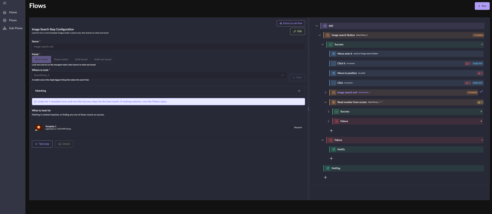
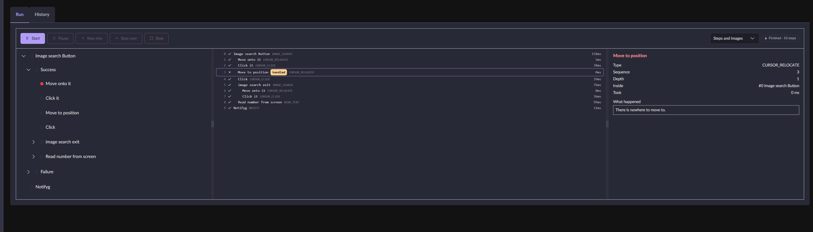

<div align="center">

<!-- SCREENSHOT 1 — optional logo. 120x120 PNG, transparent background.
     Put it at docs/images/logo.png and uncomment:

-->

# StepinFlow

**Automate any Windows application by describing what to do on screen.**

Build a flow out of clicks, key presses, image searches and conditions — then run it with a
real debugger: breakpoints, step over, and a full history of what happened.

</div>

<!-- SCREENSHOT 2 — THE HERO. The most important image in this file.
     The workflow page: step tree on one side, the form for the selected step on the other.
     Pick a flow with 8-15 steps including a branch, so the tree shows real structure.
     Full window, ~1600px wide. Save as docs/images/workflow.png -->



---

## What it is

StepinFlow drives the **real mouse and keyboard** and reads the **real screen**, so it automates
any application — not just a browser. There is no scripting language: a flow is a tree of typed
steps you build in the UI.

It is a Windows desktop app. Everything runs locally and nothing leaves your machine.

**Why it exists.** Most automation tools either record blind coordinate clicks that break the
moment a window moves, or need the target application to expose an API. StepinFlow finds things
by looking at the screen — a template image, or text read by OCR — so a flow keeps working when
the window is somewhere else, or a different size.

---

## Features

### Build

- **Visual flow tree** — drag steps to reorder or renest them, with the move validated before it happens
- **Recorder** — perform the task once with the real mouse and keyboard; the recorder turns it into a draft flow
- **Wizard** — walks you through turning a recording into steps, cropping template images as you go
- **Reusable areas and points** — name a rectangle or a location once and reference it from any step
- **Sub-flows** — extract part of a flow into a reusable one, and call it from anywhere
- **Live validation** — a flow tells you what is broken before you run it

### See the screen

- **Image search** — OpenCV template matching, with multi-scale tolerance so a resized window still matches
- **Four search modes** — first match, every match, wait until found, wait until gone
- **Read text** — Windows OCR over a screen region, with a regex to pull out the part you want
- **Search areas that follow a window** — anchor a region to an application window and the coordinates stay correct wherever the user drags it

### Run and debug

- **Breakpoints** — click the gutter beside any step
- **Step into / step over** — step over runs a whole sub-flow and stops after it
- **Pause and continue** mid-run
- **Live run view** — every step as it happens, indented by how deep it ran
- **Execution history** — past runs kept, with per-step duration, result and location
- **Failure screenshots** — nothing is written while a flow goes well; a failure writes out the last few frames leading up to it, each named after the step that took it

<!-- SCREENSHOT 3 — the debugger, mid-run or paused on a breakpoint.
     Show the toolbar (Continue / Step into / Step over active), a breakpoint dot in the tree,
     and the run list with a few finished steps. This is the feature nothing else here has.
     Save as docs/images/debugger.png -->



### Tell you about it

- **Discord notifications** — post to a webhook when a step fails, with the reason and the template images it was looking for
- **Rate limited per bot** so a flow in a retry loop cannot flood a channel

---

## Step types

Eighteen step types you can add, in five groups. Any step that can fail has **Success** and
**Failure** branches, so a flow handles its own problems rather than stopping.

| Group | Step | What it does |
|---|---|---|
| **Control** | Wait | Pause, for a fixed time or a random range |
| | Loop | Repeat its children a number of times, or forever |
| | Go To | Jump to another step |
| | Sub-Flow | Run another flow and come back |
| | Check Value | Test what an earlier step produced |
| **Input** | Cursor Click | Click at a point, a found image, or an earlier step's result |
| | Cursor Drag & Drop | Drag between two locations |
| | Cursor Scroll | Scroll at a location |
| | Cursor Relocate | Move the cursor without clicking |
| | Keyboard Input | Type text or send key combinations |
| **Window** | Window Focus | Bring an application window to the front |
| | Window Resize | Resize a window |
| | Window Relocate | Move a window |
| **Perception** | Image Search | Find a template image on screen |
| | Read Text | OCR a region and optionally extract with a regex |
| **System** | System Command | Run a shell command and check its exit code |
| | System Action | Sleep, lock, shut down and similar |
| | Notify | Post a message to Discord |

Every step can be positioned from a **named point**, a **found image**, or **another step's
result** — which is what makes a flow survive the window moving.

---

## How it works

Three processes, talking over two named pipes:

```
 Electron main  ──"stepinflow-request"────►  .NET host      request / response
       ▲                                          │
       │        ──"stepinflow-broadcast"──────────┘         server → client push
       │
  React renderer
```

- The **.NET host** owns the database, the screen, the mouse and the keyboard.
- **Electron** is the shell and the bridge; the React renderer never talks to .NET directly.
- The IPC envelope is protobuf, the body is JSON — so adding a new DTO never touches the `.proto`.

### The execution engine

A flow is walked with an **explicit stack**, not recursion — infinite loops and `Go To` make
recursion depth unbounded, and a stack gives pause, resume and step-into almost for free.

Everything a run needs sits in memory and is dropped as the walk leaves it behind, so a flow
running for three weeks holds no more than one running for three seconds. History is written in
batches, and only if you asked for it — turning history off changes what gets stored and never
what a flow does.

---

## Tech stack

| Layer | Technology |
|---|---|
| Shell | Electron, multiple BrowserWindows |
| UI | React 19, TypeScript, Vite (rolldown) |
| Components | PrimeReact + PrimeFlex |
| State | Zustand (UI), TanStack Query (server) |
| Forms | React Hook Form + Zod |
| Backend | .NET 10, MediatR, AutoMapper |
| Data | EF Core 10 + SQLite |
| Input | SharpHook — global hook and event simulation |
| Vision | OpenCvSharp4 template matching, `Windows.Media.Ocr` |
| Capture | Direct3D11 / `Windows.Graphics.Capture` |
| IPC | Named pipes, protobuf-net ↔ protobufjs |

**DPI-aware, everything in physical pixels** — a flow authored on a 150% display runs correctly on
a 100% one.

---

## Getting started

### Requirements

- Windows 10 (build 22621) or newer
- [.NET 10 SDK](https://dotnet.microsoft.com/download)
- [Node.js](https://nodejs.org/) 20 or newer

### Run in development

```bash
git clone https://github.com/alekoundas/StepinFlow.git
cd StepinFlow
npm run install:full
npm run dev
```

That starts the Vite dev server, the .NET host and Electron together. The SQLite database is
created on first run and migrations are applied at startup.

### Build a release

```bash
npm run build
```

Publishes the backend self-contained, builds the renderer, and packages everything with
electron-builder into `dist/`.

### Useful scripts

| Script | What it does |
|---|---|
| `npm run dev` | Everything, with hot reload |
| `npm run dev:no-api` | UI only, no .NET host |
| `npm run lint` | ESLint over the renderer |
| `npm run protobuf:generate` | Regenerate the protobuf bindings |

---

## Project structure

```
backend/
  App/          Host, IPC pipes, dependency injection
  Business/     Services, IPC handlers, the execution engine
  Core/         Models, DTOs, enums, helpers — no dependencies
  DataAccess/   EF Core context, configurations, migrations
electron/       Main process, preload, protobuf bridge
frontend/src/
  features/     One folder per feature: page, components, hooks, store
  shared/       Components, models, enums, the backend API service
```

The backend is layered so `Core` knows nothing about EF, and `Business` knows nothing about the
transport. Adding a step type means a worker in `Business`, a form in `frontend/features/flow-step`,
and one line in the registration.

---

## Status

In active development, and not yet released. The builder, recorder, image search, OCR, sub-flows,
notifications and the execution engine all work. Expect rough edges around the newer screens.

See [TODO.md](TODO.md) for what is known to be missing.

---

## Licence

[GNU General Public License v3.0 or later](LICENSE).

Copyright (C) 2026 Alex Psihogios.

StepinFlow is free software: you can redistribute it and modify it under the terms of the GPL as
published by the Free Software Foundation, either version 3 or (at your option) any later version.
It is distributed in the hope that it will be useful, but **without any warranty** — without even
the implied warranty of merchantability or fitness for a particular purpose.

In short: fork it, change it, use it. If you distribute a modified version, that version has to be
open under the same licence.
